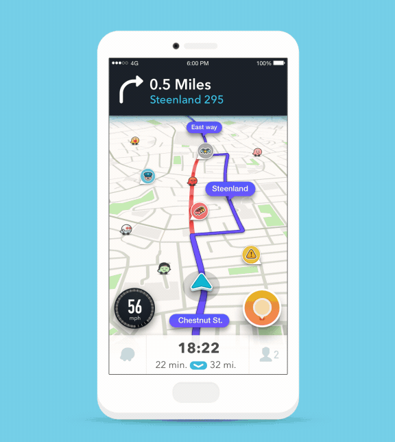
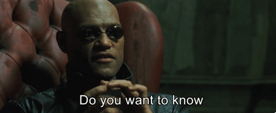

# Eu, robô? por uma #HistóriaDigital crítica no ensino e formação de professores

---

## 1. Objetivos

Propor elementos para uma reflexão geral sobre tecnologia, formação de professores e ebsibi de história em ambientes digitais, apontando para uma necessidade do fortaçecimento e disseminação de numa História Digital crítica.

---

## 2. Meios / Mídias / Métodos Digitais

### _Infinite Scroll_

[Aza Raskin](https://en.wikipedia.org/wiki/Aza_Raskin){:target="_blank"} criou em 2006 o ***infinite scroll*** e mudou profundamente a experiência nas redes sociais.

Essa mudança na estrutura do código, permitindo que o usuário permaneça atualizando a página sem precisar clicar em nada, basta "rolar" com o dedo, alterou as formas de interação e relacionamento com dados, informações e conhecimentos.

As formas de leitura e a relação com a construção de coerência e sentido tb se alteram.

Atualmente, Aza Raskin atua no [Centro de Tecnologia Humana](https://www.humanetech.com/){:target="_blank"} e em 2019 [afirmou estar arrependido de ter criado o _infinite scrolling_](https://www.thetimes.co.uk/article/i-m-so-sorry-says-inventor-of-endless-online-scrolling-9lrv59mdk){:target="_blank"}.

Podemos inclusive pensar nos exemplos usados por Chartier (CITAR) e avançarmos: a passagem do pergaminho para o index, depois do index para o livro digital. Mas agora, o próprio livro digital, especialmente quando no formato PDF, é incapaz de atender às dinâmicas de leitura significação de jovens alunos e alunas nascidos, muitas vezes, após a criação do _infinite scroll_.

PDF (_Portable Document Format_) é um formato de arquivo criado em 1993 pela _Adobe Systems_. Sua característica principal é representar documentos independentemente do software, do hardware e do sistema operacional, sem desconfigurar seu conteúdo.

Entretanto, essa própria característica que por anos o colocou como principal formato para compartilhamento de documentos, hoje não atende as práticas de leitura dos jovens alunos e alunas:

- Celular;
- Telas de tamanhos variados;
- Necessidade de acessar em diferentes dispositivos;
- Fazer marcações no documento;
- etc.

Esse é um exemplo da necessidade urgente, especialmente nesse período de pandemia , isolamento social e governos de extrema-direita que têm conseguido utilizar as mídias e redes sociais digitais com impressionante força.

---

## 3. Eu, robô? o Instagram tem certeza que sim.

Fundamental discutir os limites e vieses dos algorítmos que estão por trás de cada plataforma digital dessas.

Os algoritmos fazem a mediação entre todos os usuários e as mídias sóciais: os mecanismos de recomendação, pesquisa, preenchimento automático, classificação de tendências para atingir seu objetivo maior eficiência:

>**CONTINUE ASSITINDO, CLICANDO, COMPARTILHANDO, NAVEGANDO**

### 3.1. Mas afinal, oque é esse tal de _algoritmo_?

Um conjunto de ações lógicas para realizar uma determinada tarefa. O algoritmo (escrito por um humano) informa ao computador que passos ele deve tomar e em que ordem isso deve ser feito.

Essa lista de procedimentos é executada passo a passo até completar a ação esperada.

Os passos lógicos são encadeados, por exemplo:

`Se` tal coisa acontecer, `então` faça o passo 1, `senão` faça o passo 2.

~~~
if
else
~~~

`Enquanto` tal coisa estiver acontecendo, continue com a ação.

~~~
while == True
~~~

`Tente` executar esse passo, se não funcionar, realize a `exceção` tal.

~~~
try:
except:
~~~

~~~
if "o carro passar de 65 km/h":
    mostrar alerta de velocidade
else:
    não mostrar nada
~~~

Ou ainda:
~~~
if "a rua estiver engarrafada":
    "calcule nova rota mais curta por outra rua"
    "mostre a nova rota"
    "informe a direção"
else:
    "manter a mesma rota"
~~~

## 3.2. Algoritmos em tudo

{::options parse_block_html="false" /}

<blockquote class="twitter-tweet">
Trying a horrible experiment...  Which will the Twitter algorithm pick: Mitch McConnell or Barack Obama? <a href="https://t.co/bR1GRyCkia">pic.twitter.com/bR1GRyCkia</a>
&mdash; Tony “Abolish (Pol)ICE” Arcieri 🦀 (@bascule) <a href="https://twitter.com/bascule/status/1307440596668182528?ref_src=twsrc%5Etfw">September 19, 2020</a></blockquote>

---

**Google: Apenas um buscador de conteúdo?**

[Google acha que ferramenta em mão negra é uma arma](https://tarciziosilva.com.br/blog/google-acha-que-ferramenta-em-mao-negra-e-uma-arma/){:target="_blank"}, de [Tarcizio Silva](https://twitter.com/tarciziosilva){:target="_blank"}

---

## 4. Formação de professores/as através de uma história digital crítica

### 4.1. 90% dos discentes de minha disciplina utilizam Google como primeiro passo para pesquisa acadêmica;

- e o PageRanke?
- Por que o Google Scholar reforça concentração de citações em poucos artigos?

### 4.2. Como construir relevância na abundância digital?

- Formação interdisciplinar focada na capacitação e reflexão crítica das tecnologias de informação e comunicação;
- Enfrentar criticamente o _invisível_ por trás das plataformas através de arcabouço teórico-metodológico do campo da história e do ensino da história:
  - o **algoritmo** tb deve ser considerado como fonte no processo de pesquisa e ensino e aprendizagem

---

## 5. Por uma História Digital crítica

O desafio do “Virtual”/”Digital” está mais em voga do que nunca com a pandemia: semestre remoto, como lidar com ferramentas, conferências, compartilhamento de telas, etc etc.

O interesse em uma história digital, em suas inúmeras perspectivas, têm crescido e caminhado junto com as buscas sobre história pública - como refletido por Anita Lucchesi, na mesa [**Condições de produção da história em tempos digitais: experimentação e práticas híbridas**](https://youtu.be/0fc0fLeWlU4).

Aqui o exemplo visualmente no _Google Trends_:

  

Ao mesmo tempo corremos o grande risco de ver as desigualdades serem aprofundadas ainda mais nesse contexto: quem detém capital para adquirir equipamentos, banda larga, mas também para a realização de capacitação, formação, contratação de empresas para soluções tecnológicas etc. Enquanto alunos e professores das redes públicas, discentes das universidades que dependem de bolsas, etc, são excluídos do processo.

Por isso essas reflexões precisam ser feitas junto com nossos alunos, especialmente nas licenciaturas, para que a educação dos aspectos digitais (tanto hardware e software) sirvam para romper as opressões.

---

## 📎️ Links

- [Quem tem medo dos métodos digitais de pesquisa?](https://www.youtube.com/watch?v=x-SGWbuYTZQ&t=1374s){:target="_blank"}, Congresso virtual da UFBA 2020.

- [Tecnologia, Sociedade e Gênero](https://www.youtube.com/watch?v=J3OGleaBZWA){:target="_blank"}, painel temático SOLTEC/UFRJ.
- 
- Oficina: HISTORIADORES RODANDO PYTHON!? Uma Introdução
  - [Apresentação](https://ericbrasiln.github.io/oficina-python/){:target="_blank"}
  - [Vídeo](https://youtu.be/-6IGMyw7c6E){:target="_blank"}

- [The Programming Historian](https://programminghistorian.org/en/){:target="_blank"}

- [Computação sem caô](https://www.youtube.com/c/Computa%C3%A7%C3%A3oSemCa%C3%B4/videos){:target="_blank"}

- [Curso de Inteligência Artificial](https://www.youtube.com/playlist?list=PLtQM10PgmGogjn0cikgWi8wpQUnV6ERkY){:target="_blank"}

- [Laboratório de Humanidades Digitais da UFBA (LABHD-UFBA)](http://www.labhd.ufba.br/){:target="_blank"}

- [Laboratório em Rede em Humanidades Digitais do IBICT/UFRJ](http://www.larhud.ibict.br/){:target="_blank"}
  
- [Laboratório de Humanidades Digitais (LhuD) da FGV](https://cpdoc.fgv.br/laboratorios/lhud){:target="_blank"}
  
- [Wiki de Ferramentas Digitais (LARHUD e LABHDH-UFBA)](http://www.larhud.ibict.br/index.php?title=Ferramentas){:target="_blank"}
  
- [Digital Humanities Course Registry](https://dhcr.clarin-dariah.eu/){:target="_blank"}
  
- [Páginas de ferramentas do MediaLab do SciencePo](https://medialab.sciencespo.fr/en/tools/){:target="_blank"}
  
- [Mestrado em Humanidades Digitais da UFRRJ](https://www.dcc.ufrrj.br/ppgihd/){:target="_blank"}

- [Podcast Escafandro: Profundezas da rede - Capítulo 1: O Tabuleiro](https://www.b9.com.br/shows/escafandro/profundezas-da-rede-capitulo-1-o-tabuleiro/)

<iframe height="200px" width="100%" frameborder="no" scrolling="no" seamless src="https://player.simplecast.com/6498ec82-7fd3-40d4-9613-e4d59a17d757?dark=false"></iframe>

---

## Contatos

* E-mail: profericbrasil@unilab.edu.br

* <a href="https://twitter.com/ericbrasiln" target="_blank">Twitter - @ericbrasiln</a>

<a href ="https://studio.youtube.com/channel/UC-tuyLIm7Ww_TDjKdHdnaAg/videos" target="_blank">Canal do YouTube - 

* <a href="https://ericbrasiln.github.io/" target="_blank"> Site</a>

* <a href= "https://github.com/ericbrasiln/" target="_blank"> Github</a>

---

## Licença

GNU GENERAL PUBLIC LICENSE v.3.0

2020 Eric Brasil

